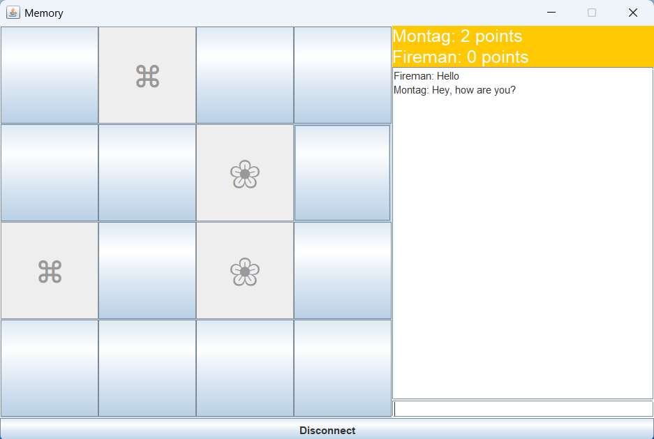

# Online Memory Game

A simple online memory game where the player flips cards and tries to find matching pairs against another player.

## How It Works
- A player starts a server and chooses difficulty aswell as a game mode.
- Two players connect using the host ipv4 address.
- One player flips a card, if they match, they stay face up. If not, they flip back.
- The game ends when all pairs are found.

## Features
- Online LAN play
- Multiple games at once capability
- Two game modes
- Three difficulty options
- Turn-based card flipping
- Chat functionality with usernames
- Basic win condition
- Very small file size

## Technologies
- Language: Java  
- UI: Swing / JFrame

## How to Run
1. Install jdk25
2. Run the server file or serverGUI class if cloned
3. Run the client file or GUI class and connect to server
